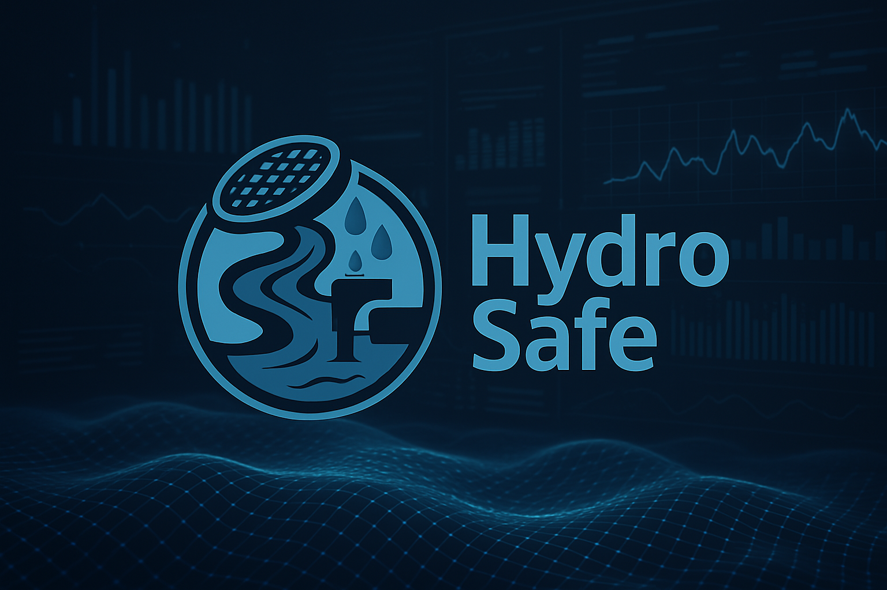

# HydroSafe - Sistema Inteligente de Monitoramento de Enchentes

[](https://#)[](LICENSE)
[](https://www.arduino.cc/)
[](https://isocpp.org/)

<p align="center">
  
</p>

**HydroSafe** é um sistema de monitoramento em tempo real focado na prevenção de enchentes urbanas através da medição contínua dos níveis de água em bueiros, galerias pluviais e rios. Utilizando sensores acessíveis e tecnologia IoT (potencial), o HydroSafe visa fornecer alertas antecipados para autoridades e comunidades, ajudando a mitigar danos materiais e, principalmente, a salvar vidas.

---

## ⚠️ Aviso Importante

- Este software/hardware é um protótipo destinado a auxiliar no monitoramento de níveis de água para prevenção de enchentes e deve ser utilizado para fins educacionais e de desenvolvimento.

- A precisão dos dados depende da correta instalação, calibração e manutenção dos sensores e do sistema.

- Fatores ambientais (detritos, obstruções, condições climáticas extremas) podem afetar o desempenho dos sensores.

- O HydroSafe utiliza componentes eletrônicos que requerem instalação cuidadosa, especialmente em ambientes úmidos ou externos. Garanta a devida proteção contra água e intempéries.

---

## ✨ Funcionalidades Principais

- 🌊 **Monitoramento Contínuo:** Medição em tempo real do nível da água usando sensor ultrassônico.

- 🚦 **Indicadores Visuais:** LEDs de status (Verde: Normal, Amarelo: Alerta, Vermelho: Perigo) para rápida identificação do risco.

- 🔊 **Alerta Sonoro:** Buzzer integrado para emitir alarmes audíveis em níveis críticos.

- 📟 **Display Local:** Tela OLED SH1107 para visualização direta do nível da água.

## 🛠️ Tecnologias Utilizadas

- **Hardware:**
  - Microcontrolador: Arduino Uno (ou compatível)
  - Sensor: Ultrassônico HC-SR04
  - Indicadores: LEDs (Verde, Amarelo, Vermelho)
  - Alerta: Buzzer Passivo
  - Display: OLED SH1107

- **Software:**
  - Linguagem: C++
  - Simulação: Wokwi

- **Bibliotecas Arduino:**
  - `LiquidCrystal_I2C`
  - `U8g2`

---

## 🏗️ Estrutura do Projeto

O projeto é composto principalmente por:

1. **Nó Sensor (Hardware):** O dispositivo físico montado com Arduino, sensores e atuadores, responsável pela coleta de dados no local.

1. **Firmware (Software):** O código `river_monitor.ino` que roda no Arduino, controlando os sensores, processando os dados e ativando os alertas.

1. **Simulação (Wokwi):** Arquivos `diagram.json` e o código `.ino` para simular o hardware e software em ambiente virtual.

---

## ⚙️ Instalação

### 1. Hardware (Montagem do Nó Sensor)

- **Conexões:** Siga o esquemático definido no `diagram.json` (ou crie um baseado nos pinos definidos no `.ino`) para conectar o sensor HC-SR04, os LEDs (com resistores apropriados), o buzzer e o display OLED SH1107 ao Arduino Uno.
  - Sensor HC-SR04: VCC, GND, Trig, Echo
  - LEDs: Anodo (+) ao pino digital via resistor, Catodo (-) ao GND.
  - Buzzer: Pino positivo (+) ao pino digital, Pino negativo (-) ao GND.
  - OLED SH1107: VCC, GND, SDA, SCL.

- **Alimentação:** Forneça alimentação adequada ao Arduino (via USB ou fonte externa).

- **Proteção:** Aloje os componentes em uma caixa protetora à prova d'água, garantindo que o sensor ultrassônico tenha uma visão clara da superfície da água a ser medida, mas esteja protegido de submersão direta e detritos.

- **Fixação:** Instale a caixa de forma segura no local de monitoramento (bueiro, margem do rio), considerando a altura máxima esperada da água.

### 2. Software (Firmware Arduino)

- **IDE:** Instale a [Arduino IDE](https://www.arduino.cc/en/software).

- **Bibliotecas:** Instale as bibliotecas `LiquidCrystal_I2C` e `U8g2`através do Gerenciador de Bibliotecas da IDE.

- **Código:** Abra o arquivo `river_monitor.ino` na Arduino IDE.

- **Configuração:** Ajuste as constantes no início do código (pinos dos componentes, altura do sensor, limiares de alerta) se sua montagem for diferente da original.

- **Upload:** Conecte o Arduino ao computador via USB, selecione a placa e a porta corretas na IDE e faça o upload do código.

### 3. Simulação (Wokwi - Opcional)

- Acesse [Wokwi.com](https://wokwi.com/).

- Crie um novo projeto Arduino.

- Copie o conteúdo do `diagram.json` para a aba `diagram.json` no Wokwi.

- Copie o conteúdo do `river_monitor.ino` para a aba do sketch (`.ino`).

- Instale as bibliotecas `LiquidCrystal_I2C` e `U8g2.`

- Inicie a simulação. Você pode interagir com o sensor ultrassônico virtual para testar os diferentes níveis e alertas.

---

## 🚀 Como Usar

1. **Energizar:** Ligue o nó sensor HydroSafe.

1. **Monitoramento Local:**

- Observe o **Display OLED SH1107**: Ele mostrará a distância medida pelo sensor de acordo com a calibração feita (a atual é com altura máxima de 1.5m) e o nível de risco atual (Normal, Alerta, Perigo).

- Observe os **LEDs**: O LED correspondente ao nível de risco atual acenderá.

- Escute o **Buzzer**: Ele soará continuamente se o nível de Perigo for atingido.

1. **Ajuste de Limiares:** Se necessário, modifique os valores `LIMITE_ALERTA` e `LIMITE_PERIGO` no código `river_monitor.ino` e faça o upload novamente para ajustar a sensibilidade dos alertas.

---

## 🎬 Demonstração

*(Insira aqui screenshots, GIFs ou links de vídeos mostrando o sistema em funcionamento)*

**Simulação no Wokwi:**

```
[IMAGEM/GIF DA SIMULAÇÃO WOKWI AQUI]
```

*Descrição breve da simulação.*

**

**Vídeo de Funcionamento:**

```
[LINK PARA VÍDEO NO YOUTUBE/VIMEO AQUI]
```

*Link para um vídeo demonstrando o HydroSafe em ação.*

---


## 📄 Licença

Este projeto é de uso **educacional e acadêmico**. Sinta-se livre para estudar, adaptar e se inspirar! 

---

> Desenvolvido com dedicação, criatividade e muitas horas de café por Enzo Ramos, Felipe Cerazi, Gustavo Peaguda e Lorenzo Coque 💻🍷


---
